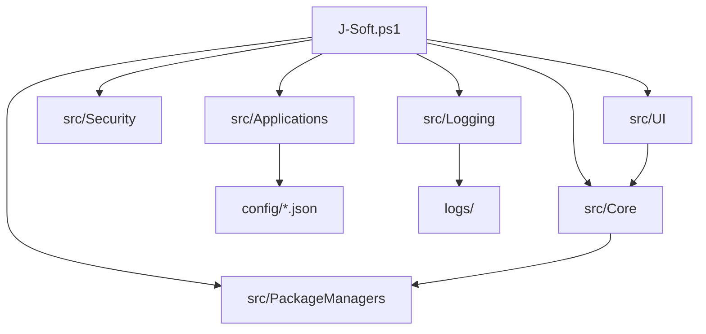

# Architektur

J-Soft ist in dieser Phase eine lokale PowerShell-WPF-Anwendung.

## Module

| Modul | Aufgabe |
| --- | --- |
| `src/Applications/Catalog.ps1` | JSON laden und validieren |
| `src/Security/Security.ps1` | Adminstatus und Paket-ID-Validierung |
| `src/Logging/Logging.ps1` | Logdateien und strukturierte Logzeilen |
| `src/PackageManagers/Winget.ps1` | WinGet-Pruefung, Detection und Installation |
| `src/PackageManagers/Chocolatey.ps1` | optionale Chocolatey-Unterstuetzung |
| `src/Core/Installer.ps1` | Installations-Runspace und Ereignisqueue |
| `src/UI/MainWindow.ps1` | WPF-Oberflaeche, Navigation, Status, Verlauf |

## Abgrenzung

J-Soft laedt keine Funktionen aus `winutil.ps1`. Die Datei bleibt Referenz und Herkunftskontext.
