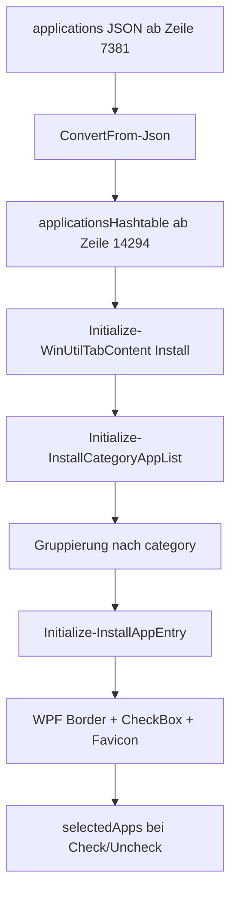

# J-Soft Analyse des aktuellen WinUtil-Bestands

Stand: 2026-07-31

## Analyseumfang

Im lokalen Arbeitsverzeichnis wurde nur eine produktive Datei gefunden:

| Pfad | Befund |
| --- | --- |
| `winutil.ps1` | Gebuendelte PowerShell-Release-Datei mit Funktionen, eingebetteten JSON-Konfigurationen und eingebettetem WPF/XAML |

Die vom Auftrag genannten Quellordner `scripts/`, `functions/public/`, `functions/private/`, `config/`, `xaml/`, `pester/`, `lint/`, `.github/` sowie Dateien wie `README.md`, `LICENSE`, `AGENTS.md`, `SPEC.md`, `Compile.ps1` und `windev.ps1` sind in dieser lokalen Kopie nicht vorhanden. Die Analyse beschreibt deshalb den tatsaechlich vorhandenen Stand der gebuendelten Datei. Wo Aussagen ueber die urspruengliche Repository-Struktur noetig sind, sind sie als Ableitung aus eingebetteten Konfigurationsnamen und Kommentaren gekennzeichnet.

## Projektstruktur und Verzeichnisaufbau

Tatsaechlicher lokaler Aufbau:

```text
J-Soft/
└── winutil.ps1
```

Ableitung aus `winutil.ps1`:

| Bereich | Eingebettet ab Zeile | Zweck |
| --- | ---: | --- |
| PowerShell-Funktionen | 84 | Laufzeitlogik, UI-Aufbau, Paketmanager, Tweaks, AppX, ISO-Funktionen |
| `applications` | 7381 | App-Katalog, entspricht vermutlich `config/applications.json` im Quellrepo |
| `appnavigation` | 9220 | Aktionsbuttons und Paketmanager-Auswahl im Install-Tab |
| `appx` | 9305 | Microsoft-AppX-Pakete |
| `dns` | 9570 | DNS-Provider |
| `feature` | 9622 | Windows-Features und Fixes |
| `preset` | 9981 | Vordefinierte Automationsprofile |
| `themes` | 10044 | UI-Theme-Werte |
| `tweaks` | 10171 | Registry-, Service-, Script- und AppX-Tweaks |
| `$inputXML` | 11839 | Eingebettete WPF/XAML-Oberflaeche |
| `$WinUtilAutounattendXml` | 13765 | Windows-11-ISO-Antwortdatei |

## Einstiegspunkte und Startprozess

Der Einstieg liegt am Anfang von `winutil.ps1`.

| Codebereich | Verhalten |
| --- | --- |
| Zeilen 8-14 | Parameter: `-Config`, `-Preset`, `-Offline`; `-Preset` ist auf `Standard`, `Minimal`, `Advanced`, leer begrenzt |
| Zeilen 16-19 | Offline-Schalter wird in `$PARAM_OFFLINE` gespiegelt |
| Zeilen 21-24 | Abbruch, wenn PowerShell nicht im `FullLanguage`-Modus laeuft |
| Zeilen 26-55 | Admin-Pruefung; bei fehlenden Rechten Relaunch per `Start-Process -Verb RunAs` |
| Zeilen 59-82 | Aufbau der synchronisierten Hashtable `$sync`, Version `26.07.17`, Logpfad unter `%LocalAppData%\winutil\logs` |
| Zeilen 14294-14301 | Erzeugung von Hashtables fuer Applications und AppX |
| Zeilen 14306-14330 | Headless-Automation fuer `-Preset` oder `-Config` ohne WPF-Fenster |
| Zeilen 14337-14790 | WPF laden, Eventhandler registrieren, `ShowDialog()` starten |

Der Self-Update-/Online-Startpfad im Admin-Relaunch nutzt in Zeile 43:

```powershell
irm https://github.com/ChrisTitusTech/winutil/releases/latest/download/winutil.ps1
```

## Build- und Compile-Prozess

Lokal ist kein Build-Skript vorhanden. Aus dem Zustand der Datei ist ableitbar:

1. Die Quellstruktur wurde vor dem Release in eine Einzeldatei kompiliert.
2. JSON-Dateien wurden als Here-Strings mit `ConvertFrom-Json` eingebettet.
3. XAML wurde in `$inputXML` eingebettet.
4. Assets wie Logo, Checkmark und Warning werden in `Invoke-WinUtilAssets` direkt als WPF-Geometrien erzeugt.

Nicht lokal pruefbar: `Compile.ps1`, CI, Tests, Linting, Release-Artefakte und GitHub Actions.

## PowerShell-Komponenten

Wichtige Funktionsgruppen:

| Gruppe | Funktionen |
| --- | --- |
| UI-Suche und Auswahl | `Find-AppsByNameOrDescription`, `Find-TweaksByNameOrDescription`, `Set-WinUtilAppCategoryFilter`, `Invoke-WPFSelectedCheckboxesUpdate` |
| UI-Erzeugung | `Initialize-WPFUI`, `Invoke-WPFUIElements`, `Initialize-InstallAppArea`, `Initialize-InstallAppEntry`, `Initialize-InstallCategoryAppList` |
| Paketmanager | `Install-WinUtilWinget`, `Install-WinUtilProgramWinget`, `Install-WinUtilChoco`, `Install-WinUtilProgramChoco`, `Test-WinUtilPackageManager` |
| Installation | `Invoke-WPFInstall`, `Invoke-WPFUnInstall`, `Invoke-WPFInstallUpgrade`, `Get-WinUtilSelectedPackages` |
| Tweaks und Features | `Invoke-WinUtilTweaks`, `Invoke-WinUtilFeatureInstall`, `Set-WinUtilRegistry`, `Set-WinUtilService`, `Set-WinUtilDNS` |
| AppX | `Get-WinUtilInstalledAPPX`, `Install-WinUtilAPPX`, `Remove-WinUtilAPPX`, `Remove-WinUtilProvisionedAPPX` |
| Automation | `Invoke-WPFImpex`, `Update-WinUtilSelections`, `Invoke-WinUtilAutoRun`, `Invoke-WPFPresets` |
| Runspaces | `Initialize-WinUtilRunspacePool`, `Invoke-WPFRunspace`, `Close-WinUtilRunspacePool`, `Invoke-WPFUIThread` |
| Logging | `Start-Transcript`, `Write-WinUtilLog`, `Write-Win11ISOLog` |
| ISO | `Invoke-WinUtilISOBrowse`, `Invoke-WinUtilISOMountAndVerify`, `Invoke-WinUtilISOModify`, `Invoke-WinUtilISOExport`, `Invoke-WinUtilISOWriteUSB` |

## WPF- und XAML-Oberflaeche

Die WPF-Oberflaeche liegt als Here-String `$inputXML` ab Zeile 11839 vor und wird ab Zeile 14337 per `Windows.Markup.XamlReader::Load()` geladen. Alle XAML-Elemente mit `Name` werden ab Zeile 14404 in `$sync` registriert. Eventhandler werden danach programmatisch angebunden.

Tabs:

| Tab | Initialisierung |
| --- | --- |
| Install | `Initialize-WinUtilTabContent "Install"` ruft `Invoke-WPFUIElements` fuer Navigation und `Initialize-WPFUI "appspanel"` auf |
| Tweaks | Lazy-Load der Tweaks-Konfiguration |
| Config | Windows-Features und Fixes |
| Updates | Statische XAML-Controls und Buttonhandler |
| Win11ISO | ISO-Workflow mit asynchronem Check bestehender Arbeit |
| AppX | AppX-Konfiguration |

## Anwendungsdatenmodell

Der App-Katalog beginnt in `winutil.ps1:7381`. Gezielt gezaehlt wurden 206 `WPFInstall...`-Eintraege. Das aktuelle App-Objekt besteht aus:

| Feld | Status | Bedeutung |
| --- | --- | --- |
| `category` | praktisch erforderlich | Gruppierung im Install-Tab |
| `choco` | erforderlich im aktuellen Modell | Chocolatey-ID oder `na` |
| `content` | erforderlich | Anzeigename in der UI |
| `description` | erforderlich | Tooltip und Suchtext |
| `link` | optional, aber fast ueberall vorhanden | Homepage und Quelle fuer Google-Favicon |
| `winget` | erforderlich im aktuellen Modell | WinGet-ID oder `na`; `msstore:` wird speziell behandelt |
| `foss` | optional/boolean | Fuegt eine FOSS-Markierung an den Namen an |

Nicht vorhanden im aktuellen App-Modell: paketindividuelle Installationsparameter, Upgrade-Parameter, Deinstallationsparameter, eigene Befehle, Abhaengigkeiten, Hersteller, interne Notizen, Admin-Flag, Erkennungsregeln, explizite Icon-Dateien, Schema-Version.

Beispiel aus dem Bestand:

```json
"WPFInstall7zip": {
  "category": "Utilities",
  "choco": "7zip",
  "content": "7-Zip",
  "description": "7-Zip is a free and open-source file archiver utility...",
  "link": "https://www.7-zip.org/",
  "winget": "7zip.7zip",
  "foss": true
}
```

## Laden und Darstellen der Anwendungen



Die UI generiert fuer jeden Eintrag eine Kachel. Der WPF-Name wird aus dem Key abgeleitet, Bindestriche werden fuer den WPF-Checkbox-Namen durch Unterstriche ersetzt; der Original-Key bleibt im `Tag`.

## Paketmanager-Integration

### WinGet

`Install-WinUtilProgramWinget` baut Argumente als Array:

| Aktion | Befehl |
| --- | --- |
| Install | `winget install --id <id> --accept-package-agreements --accept-source-agreements --source <winget|msstore> --silent` |
| Uninstall | `winget uninstall --id <id> --source <winget|msstore> --silent` |
| Upgrade alle | `winget upgrade --all --include-unknown --silent --accept-source-agreements --accept-package-agreements` in separatem PowerShell-Fenster |

IDs mit Prefix `msstore:` werden auf Quelle `msstore` umgestellt.

### Chocolatey

`Install-WinUtilChoco` installiert Chocolatey bei Bedarf durch Download und Ausfuehrung von `https://community.chocolatey.org/install.ps1`. Paketaktionen:

| Aktion | Befehl |
| --- | --- |
| Install | `choco install <ids> -y` |
| Uninstall | `choco uninstall <ids> -y` |
| Upgrade alle | `choco upgrade all -y` in separatem PowerShell-Fenster |

## Installations-, Update- und Deinstallationsablaeufe

1. Auswahl landet in `$sync.selectedApps`.
2. `Get-WinUtilSelectedPackages` dedupliziert IDs und teilt nach Manager-Praeferenz.
3. Bei Praeferenz `Choco` wird Chocolatey genutzt, wenn `choco` nicht `na` ist; sonst Fallback auf WinGet.
4. Bei Praeferenz `Winget` werden nur WinGet-IDs genutzt.
5. Installation und Deinstallation laufen in `Invoke-WPFRunspace`.
6. UI-Elemente werden waehrenddessen deaktiviert und Fortschritt/Taskbar aktualisiert.
7. Fehler werden pro Workflow gefangen und geloggt; die Verarbeitung einzelner WinGet-Pakete prueft Exit-Codes nur im Log, nicht als harte Fehlerbehandlung je Paket.

## Presets, Import und Export

`preset` ist ab Zeile 9981 eingebettet. `-Preset` selektiert Eintraege aus `$sync.configs.preset.<Name>` und ruft `Invoke-WinUtilAutoRun` auf. `-Config` laedt eine lokale oder HTTP(S)-JSON-Liste und fuehrt ebenfalls AutoRun aus.

`Invoke-WPFImpex` exportiert nur eine flache Liste der selektierten Keys. Es exportiert keine vollstaendige App-Konfiguration. Beim Export wird ein Clipboard-Befehl mit `https://christitus.com/win` erzeugt.

## Administratorrechte

WinUtil erzwingt Adminrechte beim Start. Wenn nicht erhoeht gestartet, wird ein neues PowerShell- oder Windows-Terminal-Fenster mit `-Verb RunAs`, `-ExecutionPolicy Bypass`, `-NoProfile` gestartet.

## Logging und Fehlerbehandlung

Logs liegen unter `%LocalAppData%\winutil\logs\winutil_<timestamp>.log`. `Start-Transcript` startet direkt nach `$sync`-Initialisierung. `Write-WinUtilLog` schreibt strukturierte Zeilen mit Zeitstempel, Level und Komponente. Viele kritische Funktionen haben `try/catch`, aber nicht alle externen Downloads oder Paketmanager-Exitcodes werden in eine konsistente Fehlersemantik ueberfuehrt.

## Runspaces und asynchrone Prozesse

`Initialize-WinUtilRunspacePool` erstellt einen RunspacePool mit maximal `NUMBER_OF_PROCESSORS` Threads und injiziert `$sync`, `$PARAM_OFFLINE` sowie alle Funktionen mit Namen `winutil|WPF`. `Invoke-WPFRunspace` startet Scriptblocks asynchron und registriert Cleanup per .NET-Callback.

## Sicherheitsmechanismen

Vorhanden:

- FullLanguage-Pruefung.
- Admin-Pruefung.
- `ValidateSet` fuer Startparameter und Paketmanager-Aktion.
- Logging.
- Bestaetigung vor App-Deinstallation.
- Einige `try/catch`-Bloecke.

Kritisch:

- Mehrere externe Skripte werden direkt heruntergeladen und ausgefuehrt.
- Import von Konfigurationen aus HTTP(S) hat keine Signatur- oder Hashpruefung.
- Tweaks enthalten Scriptblocks als Konfigurationsdaten und werden per `[scriptblock]::Create()`/`Invoke-Command` ausgefuehrt.
- Kein JSON-Schema.
- Kein manifestierter Trust-Store fuer Paketquellen.

## Tests und Qualitaetssicherung

Lokal wurden keine Test-, Pester-, Lint- oder CI-Dateien gefunden. Eine valide Aussage ueber Upstream-Testabdeckung ist aus dieser Arbeitskopie nicht moeglich.

## Build-Ausgaben und generierte Dateien

Die lokale Datei `winutil.ps1` ist selbst ein Build-Artefakt. Laufzeitgenerierung:

| Pfad | Zweck |
| --- | --- |
| `%LocalAppData%\winutil\logs` | Transcript und Logdateien |
| `%LocalAppData%\winutil\ooshutup10.exe` | Download fuer O&O ShutUp10++ |
| `%TEMP%\WinUtil_Win11ISO_*` | ISO-Arbeitsverzeichnisse |
| `%TEMP%\WinUtil_BootMount_*` | Boot-WIM-Mount |
| `%TEMP%\winutil_diskpart*.txt` | Diskpart-Skripte fuer USB |

## Externe URLs, APIs und Downloads

Wichtige technische externe Abhaengigkeiten:

| URL/Quelle | Verwendung | Bewertung fuer J-Soft |
| --- | --- | --- |
| `github.com/ChrisTitusTech/winutil/releases/latest/download/winutil.ps1` | Online-Relaunch | Muss fuer Self-Hosting ersetzt werden |
| `christitus.com/win` | Export-Clipboard-Befehl | Muss ersetzt werden |
| `community.chocolatey.org/install.ps1` | Chocolatey-Bootstrap | Nur optional behalten, mit Hash/Signatur bewerten |
| `github.com/ChrisTitusTech/powershell-profile/...` | CTT PowerShell Profile | Fuer J-Soft eher entfernen/ersetzen oder als Herkunft belassen |
| `dl5.oo-software.com/.../OOSU10.exe` | O&O ShutUp10++ Download | Hashpruefung ergaenzen |
| `live.sysinternals.com/Autologon.exe` | Autologon-Download | Hash/Signatur und Quelle dokumentieren |
| `github.com/thebookisclosed/ViVe/...zip` | ViVeTool Download | Hash/Signatur ergaenzen |
| `google.com/s2/favicons` | App-Icons aus Homepage-URL | Datenschutz/Offline-Faehigkeit pruefen |
| `winutil.christitus.com/...` | Dokumentationslinks in Features/Tweaks | Fuer J-Soft ersetzen oder als Upstream-Doku markieren |

## Vollstaendig dokumentiertes Beispielobjekt fuer J-Soft

Dieses Objekt ist ein Zielmodell-Beispiel und wurde nicht in die produktive Konfiguration geschrieben.

```json
{
  "schemaVersion": "1.0",
  "id": "jsoft.install.7zip",
  "enabled": true,
  "displayName": "7-Zip",
  "categoryId": "utilities",
  "description": "Freier Dateiarchivierer mit hoher Kompressionsrate.",
  "vendor": "Igor Pavlov",
  "homepage": "https://www.7-zip.org/",
  "licenseKind": "FOSS",
  "packageManagers": {
    "winget": {
      "id": "7zip.7zip",
      "source": "winget",
      "installArgs": ["--silent"],
      "upgradeArgs": ["--silent"],
      "uninstallArgs": ["--silent"]
    },
    "chocolatey": {
      "id": "7zip",
      "enabled": true
    }
  },
  "customCommands": {
    "install": null,
    "upgrade": null,
    "uninstall": null
  },
  "detection": {
    "type": "wingetList",
    "packageId": "7zip.7zip"
  },
  "dependencies": [],
  "requiresAdmin": true,
  "icon": {
    "type": "favicon",
    "source": "homepage"
  },
  "links": [
    {
      "label": "Homepage",
      "url": "https://www.7-zip.org/"
    }
  ],
  "notes": ""
}
```
