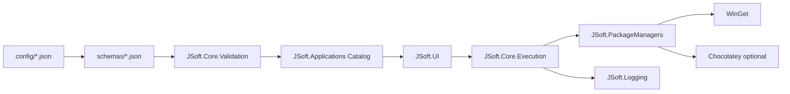
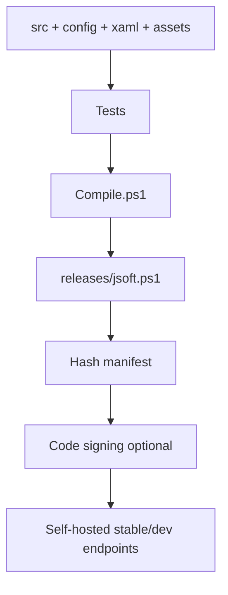

# J-Soft Zielarchitektur

## Ausgangspunkt

Die lokale Basis ist eine gebuendelte Einzeldatei `winutil.ps1`. Fuer J-Soft sollte daraus keine direkte Massenumbenennung entstehen, sondern zuerst eine modulare Struktur mit klaren Grenzen zwischen UI, Daten, Paketmanager-Logik und systemveraendernden Aktionen.

## Architekturziele

- Neue Anwendungen ohne Kerncode-Aenderung.
- Eigene Kategorien und Profile.
- Konfigurierbare Paketmanager mit WinGet als Standard und Chocolatey optional.
- Separater Editor fuer Konfigurationen.
- JSON-Schema und Schema-Versionierung.
- Testbare Kernlogik ohne WPF.
- Nachvollziehbares Logging.
- Self-Hosting mit festen Releases, Hashes und optionaler Signatur.
- Spaetere Erweiterbarkeit fuer lokale Dienste, EXE-Verpackung und Mehrbenutzerverwaltung.

## Empfohlene Zielstruktur

```text
J-Soft/
├── src/
│   ├── JSoft.Bootstrap/
│   │   └── Start-JSoft.ps1
│   ├── JSoft.Core/
│   │   ├── State.ps1
│   │   ├── Validation.ps1
│   │   └── Execution.ps1
│   ├── JSoft.Applications/
│   │   ├── ApplicationCatalog.ps1
│   │   ├── Detection.ps1
│   │   └── Profiles.ps1
│   ├── JSoft.PackageManagers/
│   │   ├── Winget.ps1
│   │   ├── Chocolatey.ps1
│   │   └── PackageManagerRegistry.ps1
│   ├── JSoft.System/
│   │   ├── Tweaks.ps1
│   │   ├── Features.ps1
│   │   ├── AppX.ps1
│   │   └── Updates.ps1
│   ├── JSoft.UI/
│   │   ├── MainWindow.xaml
│   │   ├── MainWindow.ps1
│   │   └── Controls/
│   ├── JSoft.Editor/
│   │   ├── EditorWindow.xaml
│   │   └── Editor.ps1
│   └── JSoft.Logging/
│       └── Logger.ps1
├── config/
│   ├── applications.json
│   ├── categories.json
│   ├── profiles.json
│   ├── packageManagers.json
│   ├── tweaks.json
│   └── settings.json
├── schemas/
│   ├── application.schema.json
│   ├── category.schema.json
│   └── profile.schema.json
├── tests/
│   ├── unit/
│   └── integration/
├── build/
│   ├── Compile.ps1
│   └── Release.ps1
├── docs/
├── assets/
└── releases/
```

## Begruendung

| Zielbereich | Ableitung aus Ist-Code | Zielentscheidung |
| --- | --- | --- |
| Anwendungen | Heute in `winutil.ps1:7381` fest eingebettet | Externe `config/applications.json` plus Schema |
| UI | Heute als `$inputXML` ab `winutil.ps1:11839` | XAML-Datei auslagern |
| Paketmanager | Heute Funktionen ab `winutil.ps1:1233` und `1262` | Adapter je Paketmanager |
| Runspaces | Heute globaler Pool ab `winutil.ps1:1055` und `6115` | Gemeinsamer Execution-Service |
| Tweaks | Heute JSON mit Scriptblocks ab `winutil.ps1:10171` | Stark validierte Action-Modelle, Scriptblocks nur als Ausnahme |
| Logging | Heute `%LocalAppData%\winutil\logs` | `JSoft.Logging` mit konfigurierbarem Pfad und strukturiertem JSONL optional |
| Import/Export | Heute flache Liste in `Invoke-WPFImpex` | Versionierte Exportformate fuer Auswahl, App, Profil und Vollkonfiguration |

## Zieldatenfluss



## Modulgrenzen

| Modul | Verantwortlich fuer | Darf nicht |
| --- | --- | --- |
| `JSoft.Core` | Validierung, State, sichere Ausfuehrungsplanung | Direkt WPF-Controls manipulieren |
| `JSoft.Applications` | Katalog, Profile, Detection | Shell-Kommandos frei zusammensetzen |
| `JSoft.PackageManagers` | Winget-/Chocolatey-Kommandos | UI-Dialoge anzeigen |
| `JSoft.System` | Tweaks, Features, AppX, Updates | App-Katalog kennen |
| `JSoft.UI` | Anzeige und Benutzereingaben | Rohbefehle ohne Execution-Service ausfuehren |
| `JSoft.Editor` | Konfiguration erstellen/validieren | System veraendern ohne Test-/Confirm-Pfad |
| `JSoft.Logging` | Audit- und Fehlerlogs | Geheimnisse im Klartext schreiben |

## Empfohlene App-Konfiguration

`applications.json` sollte nicht mehr WPF-Keys als fachliche IDs verwenden. Stattdessen:

- `id`: stabile technische ID, z.B. `jsoft.app.7zip`.
- `displayName`: UI-Name.
- `categoryId`: Verweis auf `categories.json`.
- `packageManagers.winget.id`: WinGet-ID.
- `packageManagers.chocolatey.id`: optional.
- `commands`: nur nach expliziter Freigabe, markiert als unsicher.
- `detection`: installierte Version erkennen.
- `dependencies`: IDs anderer Anwendungen.
- `requiresAdmin`: UI- und Execution-Hinweis.
- `schemaVersion`: Migrationen steuern.

## Build- und Release-Ziel

Der Build sollte aus Quellmodulen wieder eine signierbare Release-Datei erzeugen:



## Self-Hosting-Eignung

Die Architektur sollte zwei Kanaele unterstuetzen:

| Kanal | Zweck | Beispiel |
| --- | --- | --- |
| Stable | Getestete Version fuer Alltagssysteme | `/jsoft/stable/jsoft.ps1` |
| Dev | Vorabversionen fuer eigene Tests | `/jsoft/dev/jsoft.ps1` |

Ein Kurz-Endpunkt wie `/jsoft` sollte nur auf ein kleines Bootstrap-Skript zeigen, das Version, Hash und Signatur prueft, bevor es die eigentliche Datei startet.

## Self-Hosting-Plan

Der aktuelle Online-Pfad funktioniert nach dem Muster "PowerShell laedt Skript aus dem Internet und fuehrt es aus". In `winutil.ps1:43` wird beim Admin-Relaunch die aktuelle Release-Datei von GitHub geladen; `Invoke-WPFImpex` schreibt beim Export zudem einen Startbefehl mit `https://christitus.com/win` in die Zwischenablage.

Fuer J-Soft sollte der spaetere Kurzaufruf nur ein Komfortpfad sein:

```powershell
irm "https://example.invalid/jsoft" | iex
```

Sicherere empfohlene Methode:

```powershell
$base = "https://example.invalid/jsoft/stable"
$manifest = Invoke-RestMethod "$base/manifest.json"
$target = Join-Path $env:TEMP "jsoft-$($manifest.version).ps1"
Invoke-WebRequest "$base/jsoft.ps1" -OutFile $target
$actual = (Get-FileHash $target -Algorithm SHA256).Hash
if ($actual -ne $manifest.sha256) { throw "Hash mismatch" }
powershell.exe -ExecutionPolicy Bypass -NoProfile -File $target
```

Release-Artefakte:

| Datei | Zweck |
| --- | --- |
| `jsoft.ps1` | kompilierte PowerShell-Datei |
| `manifest.json` | Version, Kanal, SHA256, Release-Date, Mindest-Windows-Version |
| `jsoft.ps1.sig` | optionale Signatur/Detached Signature |
| `release-notes.md` | Aenderungen und bekannte Risiken |
| `checksums.txt` | Hashes fuer Offline-Pruefung |

Schutzmassnahmen:

- TLS erzwingen.
- Feste Versionen neben `stable`/`dev` bereitstellen.
- `stable` nur auf getestete Version zeigen lassen.
- Rollback durch Umstellen des `stable`-Pointers auf die vorige Version.
- Offline-Bundle als ZIP mit Manifest und Hashes anbieten.
- Optional Authenticode-Signatur fuer PowerShell-Datei und EXE-Wrapper.
- Kein automatisches Selbstupdate ohne Anzeige von Version, Quelle und Hash.
