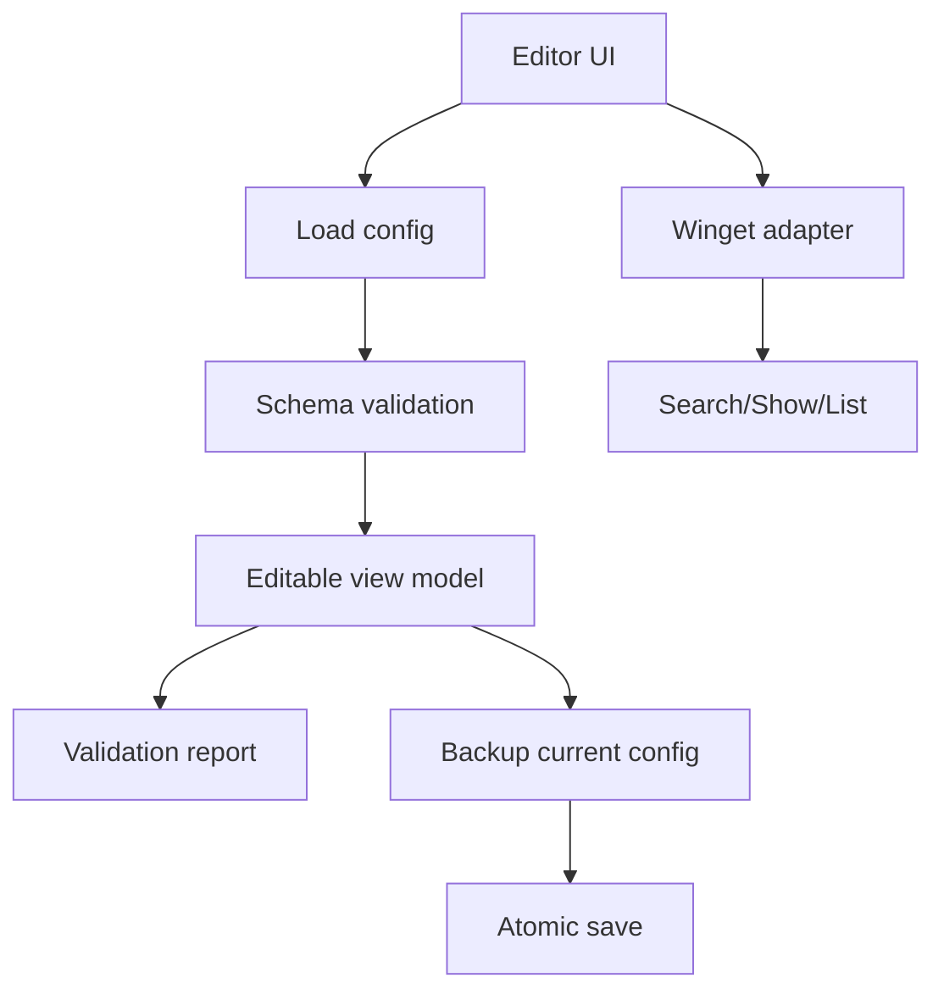

# J-Soft Editor-Konzept

## Ziel

Der Editor soll J-Soft-Konfigurationen verwalten, ohne grosse JSON-Dateien manuell zu bearbeiten. Er ist ein Administrationswerkzeug fuer Anwendungen, Kategorien, Profile, Paketmanagerdaten, Import/Export und Validierung.

## Kernfunktionen

| Bereich | Funktionen |
| --- | --- |
| Anwendungen | Hinzufuegen, bearbeiten, loeschen, duplizieren, aktivieren/deaktivieren |
| Metadaten | Name, Beschreibung, Kategorie, Hersteller, Homepage, Icon, Notizen |
| Paketmanager | WinGet-ID, optionale Chocolatey-ID, Quelle, Version, Parameter |
| Befehle | Install, Upgrade, Uninstall als kontrollierte Sonderfaelle |
| Detection | WinGet-list, Registry, Datei, MSI ProductCode, benutzerdefinierte Regel |
| Abhaengigkeiten | App-IDs, Reihenfolge, Konflikte |
| Profile | Standard-PC, Gaming-PC, Techniker-PC, Server-Werkzeuge |
| Import/Export | Vollkonfiguration, einzelne Apps, Profile, Backups mit Schema-Version |

## WinGet-Funktionen

Der Editor sollte WinGet nicht per freiem String ausfuehren, sondern ueber einen Adapter:

```powershell
winget search <Suchbegriff> --accept-source-agreements
winget show --id <PaketId> --source winget
winget list --id <PaketId>
```

Geplante Validierungen:

| Pruefung | Umsetzung |
| --- | --- |
| Existiert ID? | `winget show --id <id> --source winget` |
| Paketversion | Ausgabe von `winget show` strukturiert parsen, wenn moeglich |
| Quelle | Nur erlaubte Quellen `winget`, `msstore`, spaeter eigene Quellen |
| Doppelte IDs | Katalogweit eindeutige `winget.id` und `chocolatey.id` melden |
| Parameter | Allowlist je Paketmanager; freie Parameter als Warnung markieren |
| Testinstallation | Dry-run/Preview, Snapshot/Restore-Hinweis, explizite Bestaetigung |

## Editor-Architekturvarianten

| Variante | Aufwand | Wartbarkeit | Kompatibilitaet | Sicherheit | Bedienbarkeit | Erweiterbarkeit | Testbarkeit | EXE | Self-Hosting | Mehrbenutzer |
| --- | --- | --- | --- | --- | --- | --- | --- | --- | --- | --- |
| A: Editor als weiterer Bereich in bestehender WPF-App | niedrig-mittel | mittel | hoch | mittel | mittel | begrenzt | mittel | schwer | begrenzt | schwach |
| B: Separate PowerShell-WPF-App `JSoft.Editor.ps1` | mittel | mittel | hoch | mittel | gut | mittel | mittel | moeglich mit Wrapper | gut fuer lokale Config | schwach-mittel |
| C: Separate Desktop-App C#/.NET WPF oder WinUI 3 | hoch | hoch | mittel | hoch | sehr gut | hoch | hoch | sehr gut | mittel | mittel |
| D: Lokale Weboberflaeche mit Backend auf `127.0.0.1` | hoch | hoch | mittel | kritisch, aber gut gestaltbar | sehr gut | sehr hoch | hoch | Backend als Dienst/EXE | sehr gut | hoch |

## Bewertung

### Variante A

Vorteile:

- Schnellster Weg, weil bestehende UI, State und Paketmanagerfunktionen direkt nutzbar sind.
- Keine zweite Anwendung.

Nachteile:

- Vermischt normale Benutzeroberflaeche und Administrationsbereich.
- Erhoeht Risiko, dass Editor-Funktionen versehentlich systemveraendernde Aktionen ausloesen.
- Schlechter fuer Self-Hosting und spaetere Mehrbenutzerverwaltung.

### Variante B

Vorteile:

- Gute Kompatibilitaet mit der aktuellen PowerShell-WPF-Basis.
- Klare Trennung zwischen Anwender-App und Editor.
- Schnell genug fuer eine erste J-Soft-Version.

Nachteile:

- PowerShell-WPF bleibt schwerer testbar als .NET.
- Komplexere UI-Funktionen wie Drag-and-drop, Validierungsraster und Diff-Ansichten sind moeglich, aber aufwendiger.

### Variante C

Vorteile:

- Saubere Desktop-Architektur, stark typisierte Modelle, gute Tests.
- Sehr gut fuer EXE, Code-Signing und professionelle Bedienung.
- WinUI 3 bietet moderne UI, WPF bietet stabile Windows-Kompatibilitaet.

Nachteile:

- Hoeherer initialer Aufwand.
- Bestehende PowerShell-Logik muss ueber Adapter oder Prozessaufrufe angebunden werden.

### Variante D

Vorteile:

- Sehr gut fuer spaeteres Self-Hosting, Mehrbenutzer, Rollen, Audit, Remote-Verwaltung.
- Frontend kann komfortable Tabellen, Suche, Drag-and-drop und Diff-Ansichten bieten.

Nachteile:

- Lokales Backend auf `127.0.0.1` braucht klares Auth-/CSRF-/Origin-Konzept.
- Mehr bewegliche Teile.
- Fuer rein lokale Windows-Verwaltung anfangs schwerer als noetig.

## Empfehlung

Technische Empfehlung: Variante B fuer die naechste praktische Phase, mit Datenmodell und Service-Schicht so gestalten, dass ein spaeterer Wechsel zu Variante C oder D moeglich bleibt.

Begruendung:

- Sie passt am besten zum vorhandenen PowerShell-WPF-Stand.
- Sie trennt Editor und Anwenderoberflaeche ausreichend.
- Sie vermeidet den grossen Startaufwand einer neuen .NET- oder Webplattform.
- Sie kann dieselben JSON-Schemas und Paketmanager-Adapter nutzen, die spaeter auch in C# oder einem lokalen Backend wiederverwendet werden.

## Empfohlene Editor-Ansichten

| Ansicht | Zweck |
| --- | --- |
| Anwendungen | Tabellenliste mit Suche, Filter, Aktiv-Status, Kategorie, IDs |
| Detail | Formular fuer ein App-Objekt |
| WinGet-Suche | Suchbegriff, Ergebnisse, Uebernahme der ID |
| Kategorien | Reihenfolge, Umbenennen, Loeschen, Drag-and-drop |
| Profile | App-Auswahl pro Profil, Export |
| Validierung | Fehler, Warnungen, Duplikate, unsichere Befehle |
| Backup/Restore | Sichern, Wiederherstellen, Diff vor Uebernahme |

## Datenfluss im Editor



## Minimaler erster Editor-Scope

1. `applications.json`, `categories.json`, `profiles.json` laden und sichern.
2. Anwendung erstellen, bearbeiten, duplizieren, deaktivieren.
3. WinGet-ID suchen und validieren.
4. Duplikate und fehlende Pflichtfelder anzeigen.
5. Export/Import mit `schemaVersion`.

Nicht in Version 1: automatische Testinstallation ohne Schutzkonzept, Remote-Mehrbenutzer, freie Custom Commands ohne Review-Workflow.
